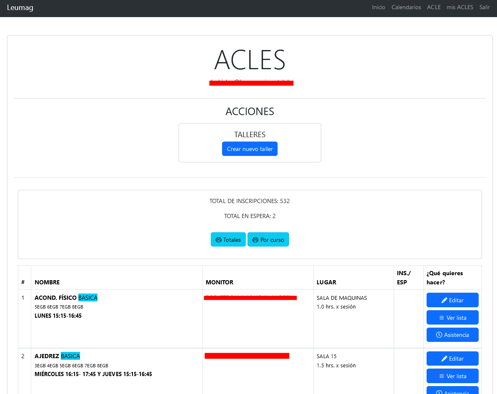
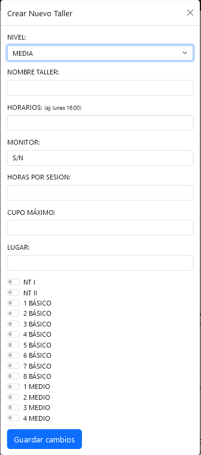
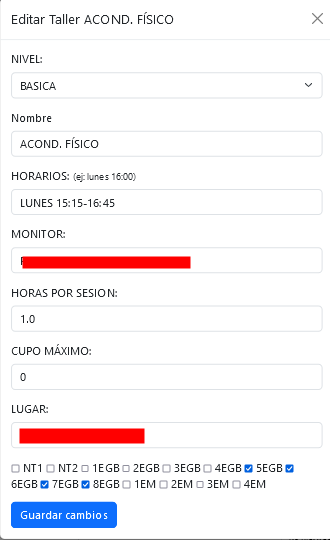
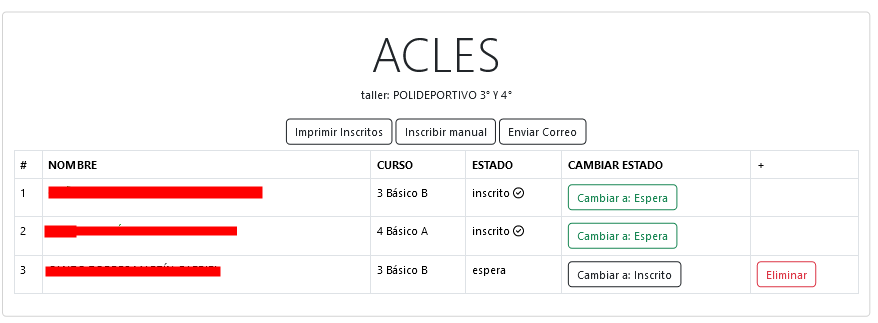
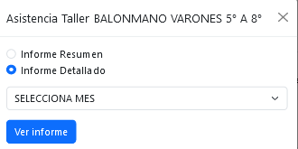

# ACLES
Esta aplicación está diseñada para facilitar la gestión de los talleres ACLE que el establecimiento imparte. Para acceder, haga clic en el menú superior sobre la opción "ACLE". Una vez que ingrese a la plataforma, se visualizará la siguiente pantalla:

De manera general puede:
- Crear nuevos talleres

De manera particular (por cada taller) puede:
- Modificar taller
- Asignar cursos
- Asignar monitor
- Asignar horarios
- Gestionar listado de estudiantes
- Ver asistencia de un taller

## Crear un nuevo taller
Para crear un nuevo taller ACLE, haga clic en el botón "Crear nuevo taller". Deberá luego completar la siguiente información:
- Nivel (Media, Básica, Ed. Parvularia)
- Nombre del Taller
- Horarios
- Monitor
- Horas por sesión
- Cupo máximo de estudiantes
- Lugar (ubicación)
- Cursos en los que el taller estará disponible

## Editar un taller
Para editar un taller ACLE, haga clic en el botón "Editar" del taller correspondiente. Deberá luego modificar la información que necesite cambiar:
- Nivel (Media, Básica, Ed. Parvularia)
- Nombre del Taller
- Horarios
- Monitor
- Horas por sesión
- Cupo máximo de estudiantes
- Lugar (ubicación)
- Cursos en los que el taller estará disponible

## Ver listado de un taller
Para ver el listado de estudiantes en un taller ACLE, haga clic en el botón "Ver lista" del taller correspondiente. Aquí encontrará una serie de opciones.

**Opciones**
- Imprimir inscritos
- Inscribir manualmente (inscribe de forma manual a un estudiante del listado oficial del establecimiento)
- Enviar correos (envía correos a los estudiantes inscritos)

**Listado**
- Listado de todos los estudiantes (inscritos y en espera)

### Inscribir estudiante
Para inscribir a un estudiante, haga clic en el botón "Cambiar a: inscrito". Luego, el botón pasará a color verde. Si quiere dejarlo en lista de espera, haga clic en el botón verde "Cambiar a: Espera". Esto cambiará el estado del estudiante.

### Eliminar estudiante
Para eliminar a un estudiante, este deberá estar en modo "espera". Luego haga clic en el botón "Eliminar".

## Imprimir asistencia
Para imprimir asistencia, de click en el botón "Asistencia" del taller correspondiente. Luego deberá seleccionar el tipo de informe y el mes a imrpimir (esta información es ingresada por cada monitor ACLE).
