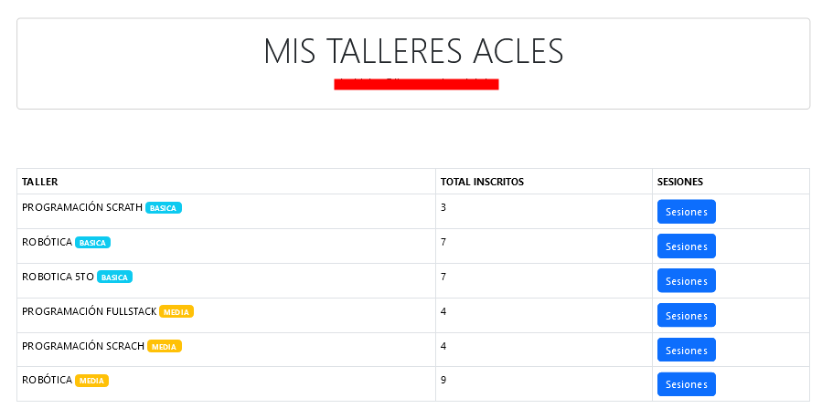
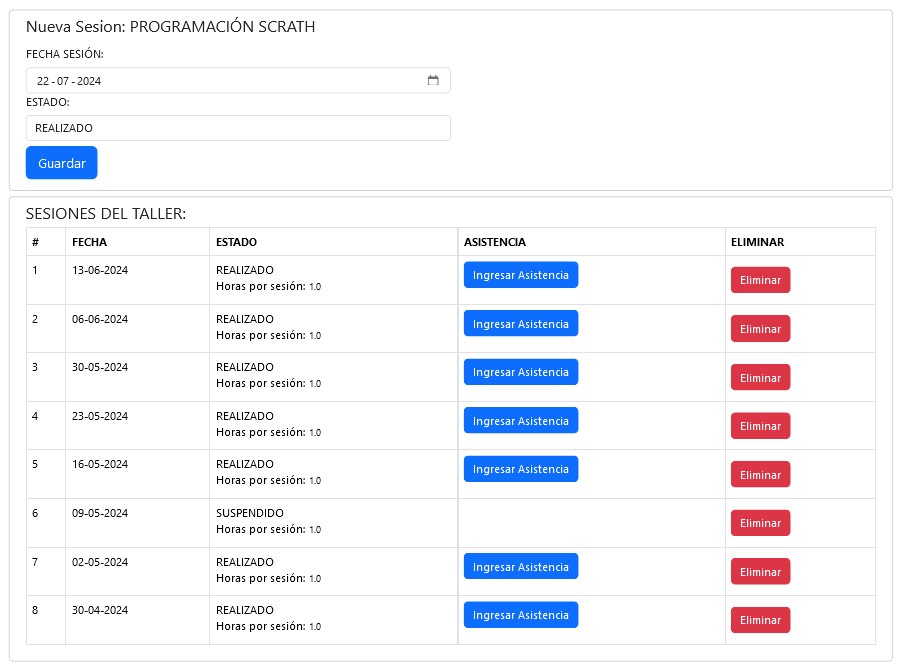
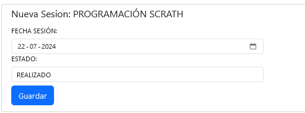
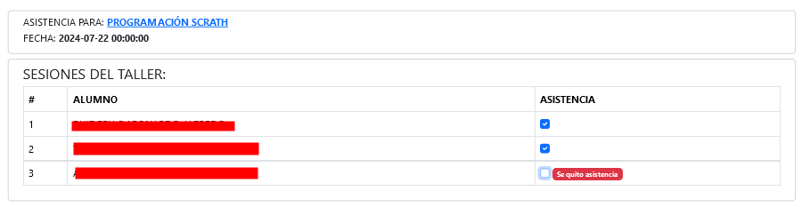
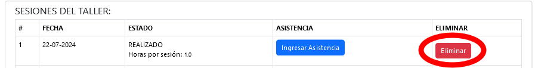

# MONITOR ACLES

Esta aplicación está diseñada para facilitar la gestión de los talleres ACLE que el monitor imparte. Para acceder, haga clic en el menú superior sobre la opción "Mis ACLES". Una vez que ingrese a la plataforma, verá la siguiente pantalla con el listado de talleres que usted imparte:

## Sesiones

Las sesiones son las clases/talleres que usted realiza durante un periodo determinado (mes). Para acceder, haga clic en el botón azul "Sesiones". En esta pantalla, podrá crear una nueva sesión o visualizar las creadas con anterioridad.

## Crear Sesiones

Para crear una nueva sesión, modifique la fecha y el estado. Posteriormente, haga clic en "Guardar".

Luego de esto, su sesión aparecerá en la parte inferior.

## Ingresar Asistencia

Para ingresar la asistencia de su sesión ya creada, haga clic en el botón "Ingresar Asistencia". Por defecto, todos los estudiantes inscritos aparecerán **presentes**. Para marcar una inasistencia, simplemente haga clic en el casillero con el ticket.

## Eliminar Sesión

Para eliminar una sesión creada, haga clic en el botón rojo "Eliminar".

