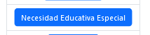
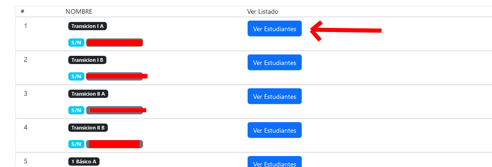
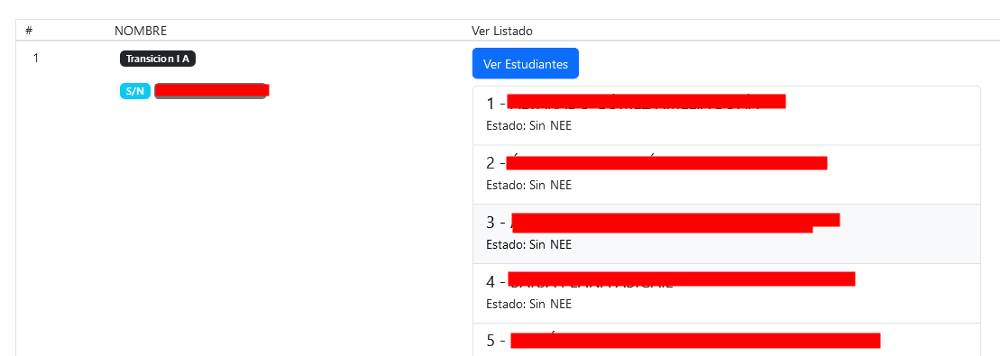
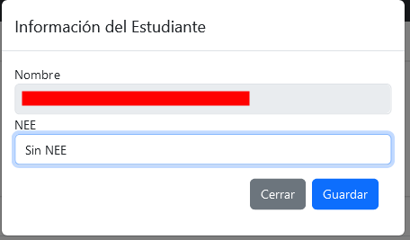
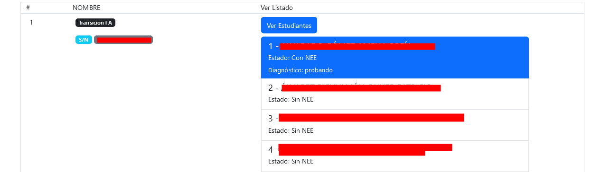

# NEE

Para acceder, haga clic en el botón azul que dice "Necesidad Educativa Especial", el cual aparecerá una vez haya iniciado sesión.

## Listado de Estudiantes

Se cargará el listado de todos los cursos. Para visualizar a los estudiantes de un respectivo nivel, haga clic en el botón azul "Ver Estudiantes".

(curso desplegado)
## Ingresar Información

Haga clic sobre el estudiante para desplegar una ventana donde podrá ingresar la información. Podrá cambiar entre dos estados:
- Sin NEE
- Con NEE

Al seleccionar la opción "Con NEE", podrá escribir un pequeño diagnóstico. Para guardar los cambios, haga clic en el botón azul "Guardar". De lo contrario, haga clic en "Cancelar" para deshacer la acción.

Si estableció la opción "Con NEE", el estudiante figurará en color verde en el listado.

