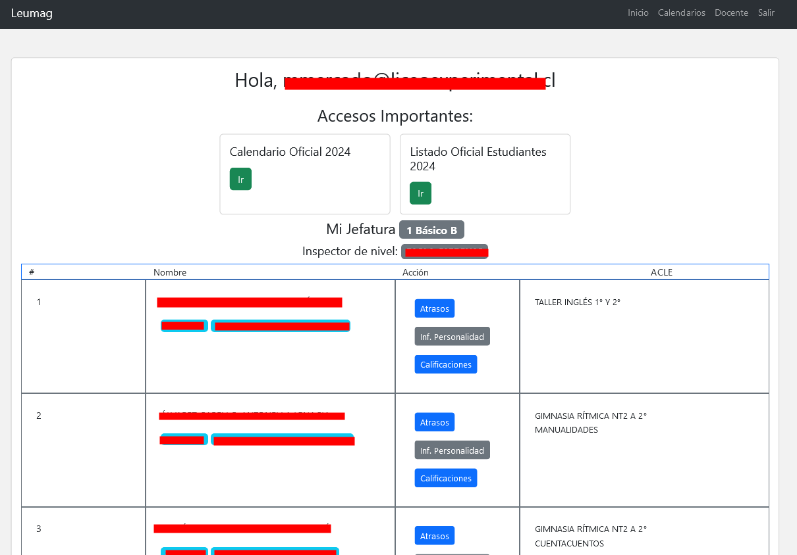

# Profesores
Una vez que ingrese a la plataforma, se visualizará la siguiente pantalla:

Aquí visualizará el listado de su jefatura, con información de cada estudiante, como el nombre, correo electrónico, rut, en que ACLEs esta inscrito, etc.

En acciones podrá:
- Ver Atrasos
- Completar informe de personalidad
- Ver Calificaciones

