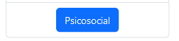
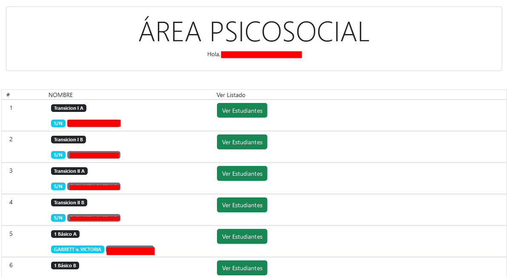
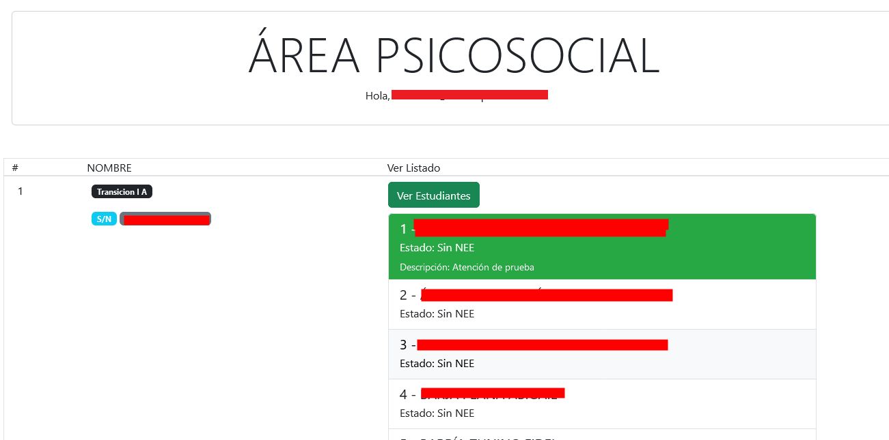
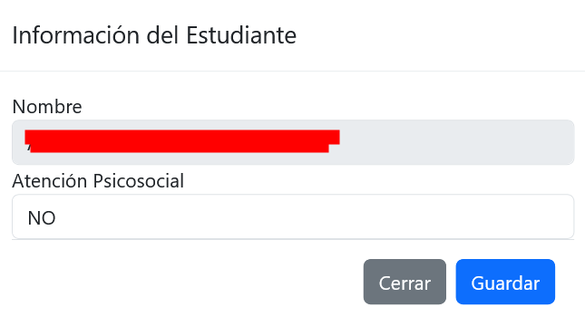
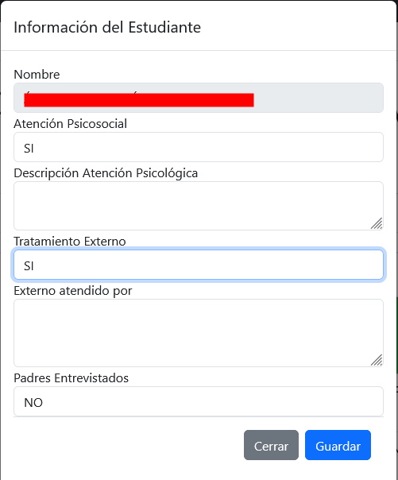

# Psicosocial

Para acceder, haga clic en el botón azul que dice "Psicosocial", el cual aparecerá una vez haya iniciado sesión.

## Listado de Estudiantes

Se cargará el listado de todos los cursos. Para visualizar a los estudiantes de un respectivo nivel, haga clic en el botón verde "Ver Estudiantes".

Los alumnos con atención psicosocial resaltarán en color verde.

## Ingresar Información

Haga clic sobre el estudiante para desplegar una ventana donde podrá ingresar la información. Primeramente, podrá cambiar entre dos estados en la opción **Atención Psicosocial**:
- NO
- SÍ

Al cambiar a SÍ, podrá ingresar la siguiente información:
- Descripción Atención Psicológica (podrá ingresar un máximo de 200 caracteres).
- Tratamiento Externo:
  - NO
  - SÍ (le permitirá especificar "Externo atendido por")
- Padres Entrevistados:
  - NO
  - SÍ

Para guardar los cambios, haga clic en el botón azul "Guardar". De lo contrario, haga clic en "Cancelar" para deshacer la acción.

Si estableció la opción **Atención Psicosocial** en "SÍ", el estudiante figurará en color verde en el listado.

